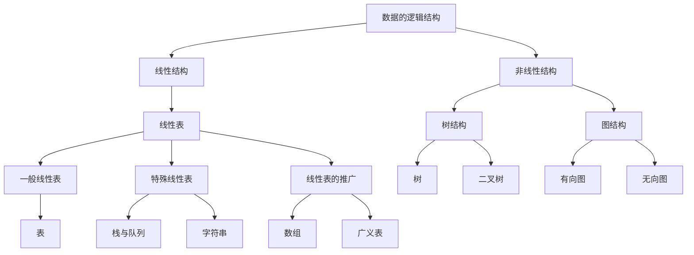

# 诸论

### 1.2 基本概念和术语

#### 1.2.1 数据、数据元素、数据项、数据对象

1. **数据（Data）**是客观事物的符号表示，是所有能输入到计算机中并被计算机程序处理的符号的总称
2. **数据元素（Data Element）**是数据的基本单位，在计算机中通常作为一个整体进行考虑和处理
3. **数据项（Data Item）**是组成数据元素的、有独立含义的、不可分割的最小单位
4. **数据对象（Data Object）**是性质相同的数据元素的集合，是数据的一个子集

#### 1.2.2 数据结构

> ##### **数据结构（Data Structure）**是相互之间存在一种或多种特定关系的数据元素集合。
>
> ##### 数据的**逻辑结构**是从逻辑关系上描述数据，它与数据的存储无关，是独立于计算机的。
>
> 数据的**逻辑结构**有两个要素：一是数据元素，二是关系。根据关系的不同特性，通常有四类基本结构。
>
> 1. **集合结构**：数据元素之间除了“属于同一集合”的关系外，别无其它关系
> 2. **线性结构**：数据元素之间存在一对一的关系
> 3. **树结构**：数据元素之间存在一对多的关系
> 4. **图结构**：数据元素之间存在多对多的关系

> ##### 数据对象在计算机中的存储表示称为数据的存储结构，也称物理结构。
>
> 数据元素在计算机中有两种基本的存储结构，分别是顺序存储结构和链式存储结构。
>
> ##### 顺序存储结构
>
> 顺序存储结构是借助元素在存储器中的相对位置表示数据元素之间的逻辑关系，所有元素依次存放在一片连续的存储空间中
>
> ##### 链式存储结构
>
> 无须占用一整块存储空间。但为了表示节点之间的关系，需要给每个节点附加指针字段，用于存放后继元素的存储位置。



#### 1.2.3 数据类型和抽象数据类型

> ##### 数据类型
>
> > 数据类型是一个值的集合和定义在这个值集上的一组操作总称。
>
> ##### 抽象数据类型
>
> > **抽象数据类型（ADT）**一般指由用户定义的、表示应用问题的数学模型，以及定义在这个模型上的一组操作的总称
> >
> > 具体包括三部分：数据对象、数据对象上关系的集合、以及对数据对象的基本操作的集合
> >
> > ```ADT
> > ADT 抽象数据类型名
> > {
> > 	数据对象：<数据对象的定义>
> > 	数据关系：<数据关系的定义>
> > 	基本操作：<基本操作的定义>
> > }ADT 抽象数据类型名
> > 
> > 基本操作（参数表）
> > {
> > 	初始条件：<初始条件描述>
> > 	操作结果：<操作结果描述>
> > }
> > ```
> >

### 1.4 算法和算法分析

#### 1.4.1 算法的定义及特性

>##### 算法（Algorithm）是为了解决某类问题而规定的一个有限长的操作序列
>
>##### 一个算法必须满足以下五个特性
>
>1. **又穷性**：一个算法必须总是在执行有穷步后结束，且每一步都必须在有穷时间内完成
>2. **确定性**：对于每种情况下所应执行的操作，在算法中都有确切的规定，不会产生二义性，使算法的执行者或阅读者都能明确其含义及如何执行
>3. **可行性**：算法中的所有操作都可以通过已经实现的基本操作运算执行有限次来实现
>4. **输入性**：有零个或多个输入
>5. **输出性**：有一个或多个输出，它是算法进行信息加工后得到的结果。

#### 1.4.2 评价算法优劣的基本标准

> 1. **正确性**：在合理的数据输入下，能够在有限的运行时间内得到正确的结果。
> 2. **可读性**：一个好的算法，首先应便于人们理解和相互交流，其次才是机器可执行性。可读性强的算法有助于人们对算法的理解，而难懂的算法易于隐藏错误，且难于调试和修改。
> 3. **健壮性**：当输入的数据非法时，好的算法能适当地做出正确反应或进行相应的处理，而不会产生莫名其妙的输出结果。
> 4. **高效性**：包括时间和空间两个方面。

#### 1.4.3 算法的时间复杂度

> ##### 衡量算法效率的方法主要有两类：事后统计法和<u>事前分析估算法</u>
>
> 一个算法的执行时间大致上等于其所有语句执行时间的总和，而语句的执行时间则为该条语句的重复执行次数和执行一次所需时间的乘积。
>
> 计算算法时间复杂度时，可以忽略所有低次幂项和最高次幂的系数
>
> **问题规模**是算法求解问题输入量的多少，是问题大小的本质表示，一般用整数n表示。
>
> 一条语句的重复执行次数称作**语句频度（Frequency Count）**
>
> 常量阶示例
>
> ```c
> 例一
>   x++;s=0;
> 例二
> for(i=0;i<1000;i++)
> 	x++;s=0;
> //T(n)=O(1)
> //算法的执行时间不随着问题规模的增长而增长，算法中语句频度就是某个常数。即使这个常数再大，算法的时间复杂度都是O(1)
> ```
>
> 线性阶示例
>
> ```c
> for(i=0;i<n;i++)
>   x++;
>   s=0;
> //T(n)=O(n)
> ```
>
> 平方阶示例
>
> ```c
> x=0;y=0;
> for(i=1;i<=n;i++)
>   x++;
> for(j=1;j<=n;j++)
>   for(k=1;k<=n;k++)
>     y++;
> //T(n)=O(n2);
> //多数情况下，当有若干个循环语句时，算法的时间复杂度是由最深层循环内的基本语句的频度决定的
> ```
>
> 对数阶示例
>
> ```c
> for(i=1;i<=n;i*=2)
>   x++;s=0;
> //T()=O(log2n)
> ```
>
> ##### 常见的时间复杂度按数量级增排序依次为：
>
> 常量阶>对数阶线性阶>线性对数阶>平方阶>立方阶>指数阶

#### 1.4.4  算法的空间复杂度

> #####   除了需要寄存本身所用的指令、常数、变量、输入数据外，还需要一些对数据进行操作的辅助存储空间。
>
> 示例
>
> ```c
> 例一
> 	for(i=0;i<n;i++)
>   	t=a[i];
>   	a[i]=a[i-1];
> 		a[i-1]=t;
> 例二
>   for(i=0;i<n;i++)
>     b[i]=a[i-1];
> 	for(i=0;i<n;i++)
>     a[i]=b[i];
> //算法一仅需要另外借助一个变量t，与问题规模n大小无关，所以其空间复杂度为O(1)
> //算法需要另外借助一个大小为n的辅助数组b，所以其空间复杂度为O(n)
> ```
>
> 对于一个算法，其时间复杂度和空间复杂度往往是相互影响的，当追求一个较好的时间复杂度时，可能会导致占用较多的存储空间。反之亦然。

 